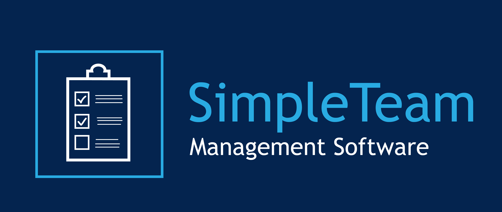
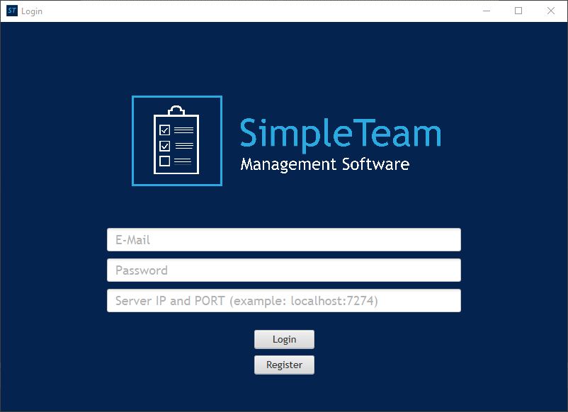

[![Contributors][contributors-shield]][contributors-url]
[![Forks][forks-shield]][forks-url]
[![Stargazers][stars-shield]][stars-url]
[![Issues][issues-shield]][issues-url]
[![MIT License][license-shield]][license-url]
[![LinkedIn][linkedin-shield]][linkedin-url]


<!-- PROJECT LOGO -->
<br />
<p align="center">
  <a href="https://github.com/alex-hiermann/simpleTeam">
    
  </a>

  <h3 align="center">SimpleTeam</h3>

  <p align="center">
    A management tool for you, your friends and your team!
    <br />
    <a href="https://github.com/alex-hiermann/simpleTeam"><strong>Explore the docs »</strong></a>
    <br />
    <br />
    <a href="https://github.com/alex-hiermann/simpleTeam">View Demo</a>
    ·
    <a href="https://github.com/alex-hiermann/simpleTeam/issues">Report Bug</a>
    ·
    <a href="https://github.com/alex-hiermann/simpleTeam/issues">Request Feature</a>
  </p>
</p>


<!-- TABLE OF CONTENTS -->
<details open="open">
  <summary>Table of Contents</summary>
  <ol>
    <li>
      <a href="#about-the-project">About The Project</a>
      <ul>
        <li><a href="#built-with">Built With</a></li>
      </ul>
    </li>
    <li>
      <a href="#getting-started">Getting Started</a>
      <ul>
        <li><a href="#prerequisites">Prerequisites</a></li>
        <li><a href="#installation">Installation</a></li>
      </ul>
    </li>
    <li><a href="#usage">Usage</a></li>
    <li><a href="#roadmap">Roadmap</a></li>
    <li><a href="#contributing">Contributing</a></li>
    <li><a href="#license">License</a></li>
    <li><a href="#contact">Contact</a></li>
    <li><a href="#acknowledgements">Acknowledgements</a></li>
  </ol>
</details>


<!-- ABOUT THE PROJECT -->
## About The Project

<p align="center">
  
</p>

We created SimpleTeam in order to help everyone keeping their to-do list as dynamic, compact and efficiently as possible, unimportant if you are only one, or maybe a whole team of many people, there is enough space for everyone!

Interested? Here are some special things about SimpleTeam:
* Create a team for your own organisation in order to manage your own- and others to-dos
* Connect your to-do lists between multiple devices so that you are always aware of the next tasks
* Chat with others in your organisation and inform yourself for up-coming tasks

<!-- Of course, no ones template will serve all projects since your needs may be different. So I'll be adding more in the near future. You may also suggest changes by forking this repo and creating a pull request or opening an issue. Thanks to all the people have have contributed to expanding this template!

A list of commonly used resources that I find helpful are listed in the acknowledgements. -->

### Built With

With the intention, to get a wide platform support we built our whole GUI with [JavaFX](https://openjfx.io/).

<!-- GETTING STARTED -->
<!-- ## Getting Started

This is an example of how you may give instructions on setting up your project locally.
To get a local copy up and running follow these simple example steps.

### Prerequisites

This is an example of how to list things you need to use the software and how to install them.
* npm
  ```sh
  npm install npm@latest -g
  ```

### Installation

1. Get a free API Key at [https://example.com](https://example.com)
2. Clone the repo
   ```sh
   git clone https://github.com/your_username_/Project-Name.git
   ```
3. Install NPM packages
   ```sh
   npm install
   ```
4. Enter your API in `config.js`
   ```JS
   const API_KEY = 'ENTER YOUR API';
   ``` -->


<!-- USAGE EXAMPLES -->
## Usage

If you are on your own, it's an efficient to-do manager. Synchronize your tasks between multiple devices and stay always up-to-date.

Maybe you have a whole team with lots of things to manage - no problem - there are many functions implemented to create a team, invite your teammembers, manage their to-dos and also their organizational rights.


<!-- ROADMAP -->
## Roadmap

See the [open issues](https://github.com/alex-hiermann/simpleTeam/issues) for a list of proposed features (and known issues).


<!-- CONTRIBUTING -->
<!-- ## Contributing

Contributions are what make the open source community such an amazing place to be learn, inspire, and create. Any contributions you make are **greatly appreciated**.

1. Fork the Project
2. Create your Feature Branch (`git checkout -b feature/AmazingFeature`)
3. Commit your Changes (`git commit -m 'Add some AmazingFeature'`)
4. Push to the Branch (`git push origin feature/AmazingFeature`)
5. Open a Pull Request -->


<!-- LICENSE -->
## License

Distributed under the BSD-2-Clause License. See `LICENSE` for more information.


<!-- CONTACT -->
## Contact

Alexander Hiermann:
* Github: [alex-hiermann](https://github.com/alex-hiermann)
* LinkedIn: [Alexander Hiermann](https://linkedin.com/in/alexander-hiermann)
* Email: [Alexander Hiermann](mailto:alex.hiermann@gmx.com)
* Twitter: [@GameAlexZocktYT](https://twitter.com/GameAlexZocktYT)
* Instagram: [@alex.hier](https://instagram.com/alex.hier)

Maximilian Burger:
* Github: [ProRedMax](https://github.com/ProRedMax)
* LinkedIn: [Maximilian Burger](https://linkedin.com/in/maximilian-burger-81a9581b3)
* Email: [Maximilian Burger](mailto:mabug@outlook.de)
* Twitter: [@maxx_bur](https://twitter.com/maxx_bur)
* Instagram: [@maxx.bur](https://instagram.com/maxx.bur)

Project Link: [https://github.com/alex-hiermann/simpleTeam](https://github.com/alex-hiermann/simpleTeam)


<!-- ACKNOWLEDGEMENTS -->
## Acknowledgements
* [Special thanks to Thomas Wachter for his amazing building-skills!](https://github.com/thomasw04)
* [Special thanks to Othneil Drew for his wonderful README!](https://github.com/othneildrew)
* [Img Shields](https://shields.io)
* [GitHub Pages](https://pages.github.com)


<!-- MARKDOWN LINKS & IMAGES -->
<!-- https://www.markdownguide.org/basic-syntax/#reference-style-links -->
[contributors-shield]: https://img.shields.io/github/contributors/alex-hiermann/simpleTeam.svg?style=for-the-badge
[contributors-url]: https://github.com/alex-hiermann/simpleTeam/graphs/contributors
[forks-shield]: https://img.shields.io/github/forks/alex-hiermann/simpleTeam.svg?style=for-the-badge
[forks-url]: https://github.com/alex-hiermann/simpleTeam/network/members
[stars-shield]: https://img.shields.io/github/stars/alex-hiermann/simpleTeam.svg?style=for-the-badge
[stars-url]: https://github.com/alex-hiermann/simpleTeam/stargazers
[issues-shield]: https://img.shields.io/github/issues/alex-hiermann/simpleTeam.svg?style=for-the-badge
[issues-url]: https://github.com/alex-hiermann/simpleTeam/issues
[license-shield]: https://img.shields.io/github/license/alex-hiermann/simpleTeam.svg?style=for-the-badge
[license-url]: https://github.com/alex-hiermann/simpleTeam/blob/master/LICENSE.txt
[linkedin-shield]: https://img.shields.io/badge/-LinkedIn-black.svg?style=for-the-badge&logo=linkedin&colorB=555
[linkedin-url]: https://linkedin.com/in/alexander-hiermann
